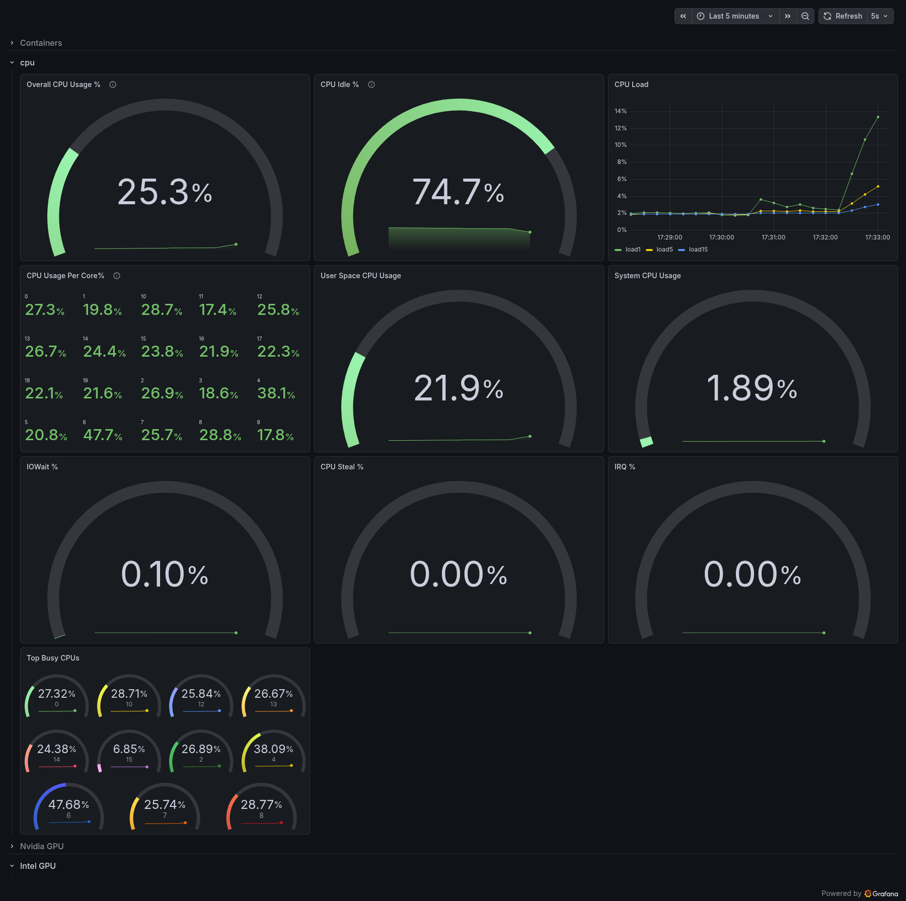
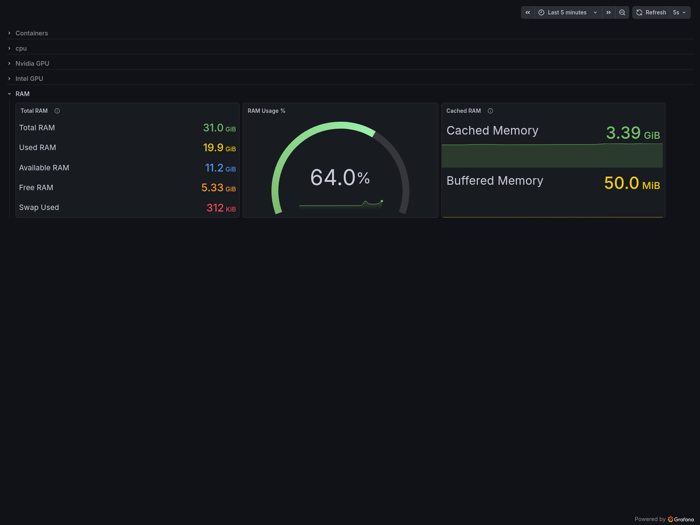
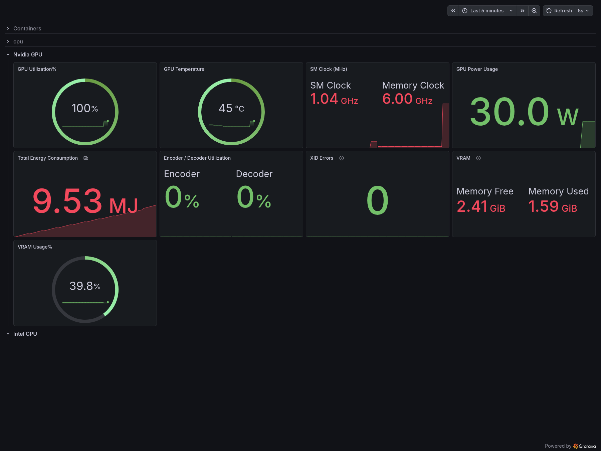
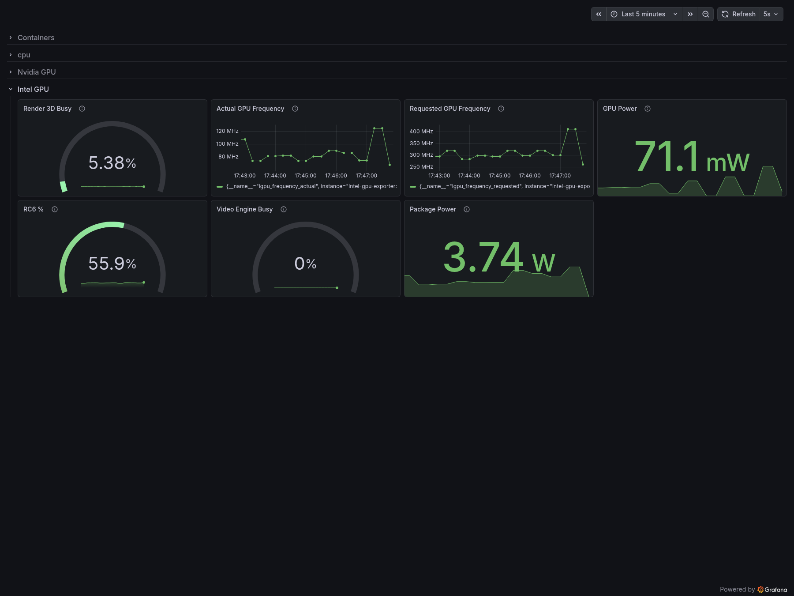
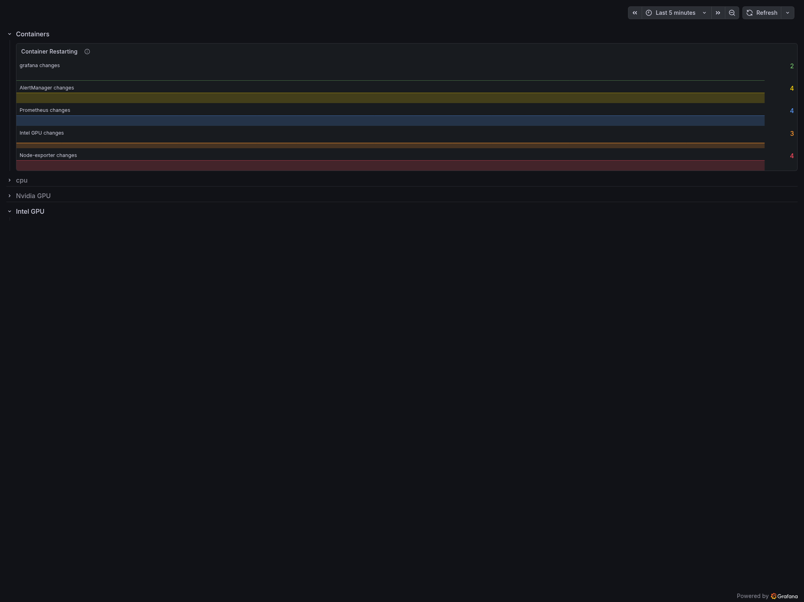
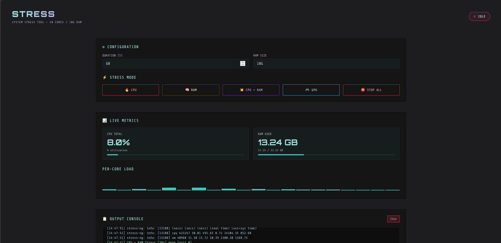
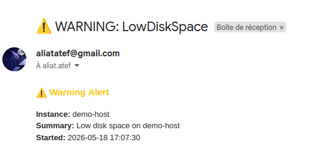

# 📊 Prometheus-Grafana Monitoring Stack

<div align="center">

[](https://www.docker.com/)
[](https://prometheus.io/)
[](https://grafana.com/)
[](https://www.nvidia.com/)

A production-ready **observability stack** with real-time infrastructure monitoring, advanced alerting, GPU telemetry, and beautiful dashboards.

[Features](#-features) • [Quick Start](#-quick-start) • [Architecture](#-architecture) • [Dashboards](#-dashboards) • [Troubleshooting](#-troubleshooting)

</div>

---

## 📌 What's Included?

This complete monitoring solution provides:

- 📈 **Prometheus** - Metrics collection & time-series database
- 📊 **Grafana** - Production-grade visualization dashboards
- 🚨 **Alertmanager** - Intelligent alert routing & Slack notifications
- 🖥️ **Node Exporter** - System metrics (CPU, RAM, disk, network)
- 🎮 **Intel GPU Exporter** - Intel GPU telemetry
- ⚡ **NVIDIA DCGM Exporter** - NVIDIA GPU monitoring
- 🧪 **Custom Flask App** - Application metrics & stress testing
- 🔔 **Slack Integration** - Real-time alert notifications
- 🐳 **Docker Compose** - One-command containerized deployment

---

## 🚀 Features

| Feature | Status | Description |
|---|---|---|
| 📈 Real-Time Monitoring | ✅ | Live infrastructure & application metrics with 15s scrape intervals |
| 🎮 GPU Monitoring | ✅ | Full NVIDIA & Intel GPU telemetry (utilization, temperature, power) |
| 🚨 Smart Alerting | ✅ | Alertmanager with routing rules, inhibition, and Slack integration |
| 📊 Grafana Dashboards | ✅ | Pre-built dashboards for CPU, RAM, GPUs, containers & more |
| 🧠 Recording Rules | ✅ | Precomputed metrics for optimized query performance |
| 🔔 Multi-Channel Alerts | ✅ | Slack notifications with routing based on severity |
| 💾 Persistent Storage | ✅ | Docker volumes preserve all monitoring data across restarts |
| 🐳 Fully Containerized | ✅ | All components run in isolated containers with Docker Compose |
| 🔐 Production Ready | ✅ | Security best practices, resource limits, health checks |

---

## 📐 Architecture

```
┌─────────────────────────────────────────────────────────────┐
│                    Monitoring Stack                         │
│                                                             │
│  ┌──────────────┐                  ┌───────────────────┐  │
│  │ My Flask App │──scrape────────┐ │                   │  │
│  │  (5000)      │               │ │                   │  │
│  └──────────────┘               │ │  PROMETHEUS       │  │
│                                 │ │  Time-Series DB   │  │
│  ┌──────────────┐               │ │  (9090)           │  │
│  │ Node Exporter│──scrape────────│                   │  │
│  │  (9100)      │               │ │  • CPU, RAM, Disk │  │
│  └──────────────┘               │ │  • Network        │  │
│                                 │ │  • Containers     │  │
│  ┌──────────────┐               │ │  • Apps           │  │
│  │ Intel GPU    │──scrape────────│                   │  │
│  │ Exporter     │               │ └─────────┬─────────┘  │
│  │  (8686)      │               │           │            │
│  └──────────────┘               │           ▼            │
│                                 │  ┌──────────────────┐  │
│  ┌──────────────┐               │  │  Alertmanager    │  │
│  │ NVIDIA DCGM  │──scrape────────→  │  (9093)          │  │
│  │ Exporter     │                  │  • Alert Routing │  │
│  │  (9400)      │                  │  • Inhibition    │  │
│  └──────────────┘                  └────────┬─────────┘  │
│                                             │            │
│                                             ▼            │
│                                        Gmail 🔔          │
│                                                         │
│     ┌────────────────────────────────────────────┐     │
│     │           GRAFANA DASHBOARDS               │     │
│     │            (3000)                          │     │
│     │  • System Overview                         │     │
│     │  • CPU & Memory Analysis                   │     │
│     │  • GPU Utilization & Performance           │     │
│     │  • Container Monitoring                    │     │
│     │  • Application Metrics                     │     │
│     └────────────────────────────────────────────┘     │
└─────────────────────────────────────────────────────────────┘
```

---

## ⚡ Quick Start

### 1️⃣ Clone the Repository

```bash
git clone https://github.com/N1N0u/PcMonitor.git
cd PcMonitor
```

### 2️⃣ Start the Stack

```bash
docker-compose up -d
```

### 3️⃣ Verify Deployment

```bash
docker-compose ps
```

Expected output:
```
CONTAINER ID   IMAGE                          STATUS
...            grafana/grafana-enterprise     Up
...            prom/prometheus                Up
...            prom/alertmanager              Up
...            prom/node-exporter             Up
...            ghcr.io/onedr0p/intel-gpu     Up
...            nvidia/dcgm-exporter           Up
...            pcmonitor_myapp                Up
```

### 4️⃣ Access Services

| Service | URL | Credentials |
|---|---|---|
| **Grafana** | http://localhost:3000 | admin / admin123 |
| **Prometheus** | http://localhost:9090 | — |
| **Alertmanager** | http://localhost:9093 | — |
| **Flask App** | http://localhost:5000 | — |


---

## 📊 Dashboards

### System Overview Dashboard
Monitor overall system health with CPU, RAM, disk utilization:



### Memory Analysis
memory usage, cache, and buffer metrics:



### NVIDIA GPU Monitoring
Real-time NVIDIA GPU metrics including utilization, temperature, power usage:



### Intel GPU Monitoring
Intel GPU frequency, power, and utilization tracking:



### Container Health
Monitor Docker container performance and status:



### Stress Testing Tool
Built-in stress test application with configurable CPU, RAM, and GPU load:



### Alert Management
View and manage alerts through Alertmanager:



---

## 🐳 Services & Ports

| Service | Port | Purpose |
|---|---|---|
| **Grafana** | 3000 | Visualization & dashboards |
| **Prometheus** | 9090 | Metrics collection & querying |
| **Alertmanager** | 9093 | Alert routing & notifications |
| **Node Exporter** | 9100 | System metrics |
| **Intel GPU Exporter** | 8686 | Intel GPU telemetry |
| **NVIDIA DCGM Exporter** | 9400 | NVIDIA GPU telemetry |
| **Flask App** | 5000 | Custom application metrics |

---

## 📈 Key Metrics & Alerts

### Infrastructure Alerts

| Alert | Threshold | Severity |
|---|---|---|
| **HighCpuUsage** | > 85% | Warning |
| **CriticalCpuUsage** | > 95% | Critical |
| **HighMemoryUsage** | > 90% | Warning |
| **CriticalMemoryUsage** | > 95% | Critical |
| **LowDiskSpace** | > 80% | Warning |
| **CriticalDiskSpace** | > 95% | Critical |
| **InstanceDown** | Unavailable | Critical |

### Precomputed Recording Rules

Optimized metrics for faster queries:

```promql
instance:cpu_usage_percent
instance:memory_usage_percent
instance:disk_usage_percent
app:error_rate_percent
app:request_latency_p95
app:request_rate_per_second
```

---

## 🔍 Useful PromQL Queries

### CPU Usage Percentage
```promql
100 - (avg by(instance)(irate(node_cpu_seconds_total{mode="idle"}[5m])) * 100)
```

### Memory Usage Percentage
```promql
100 - (node_memory_MemAvailable_bytes / node_memory_MemTotal_bytes * 100)
```

### Disk Usage Percentage
```promql
100 - (node_filesystem_avail_bytes{mountpoint="/"} / node_filesystem_size_bytes{mountpoint="/"} * 100)
```

### NVIDIA GPU Utilization
```promql
DCGM_FI_DEV_GPU_UTIL
```

### Intel GPU Power
```promql
intel_gpu_power_watts
```

### Error Rate
```promql
app:error_rate_percent
```

---

## 🛠️ Configuration

### Prometheus Configuration
Edit `prometheus.yml` to add/modify scrape targets:

```yaml
scrape_configs:
  - job_name: 'prometheus'
    static_configs:
      - targets: ['localhost:9090']
  
  - job_name: 'node-exporter'
    static_configs:
      - targets: ['node-exporter:9100']
```

### Alert Rules
Configure alerts in `alert.rules.yml`:

```yaml
groups:
  - name: infrastructure
    interval: 30s
    rules:
      - alert: HighCpuUsage
        expr: instance:cpu_usage_percent > 85
        for: 5m
        annotations:
          summary: "High CPU usage detected"
```

### Alertmanager Configuration
Set up Email notifications in `alertmanager.yml`:

---

## 🚀 Common Tasks

### View Logs
```bash
# All services
docker-compose logs -f

# Specific service
docker-compose logs -f prometheus
docker-compose logs -f grafana
```

### Restart Services
```bash
# Restart Prometheus
docker-compose restart prometheus

# Restart all
docker-compose restart
```

### Stop the Stack
```bash
docker-compose down
```

### Remove Everything (including data)
```bash
docker-compose down -v
```

### Add a New Prometheus Target

1. Edit `prometheus.yml`
2. Add new scrape job:
```yaml
  - job_name: 'my-app'
    static_configs:
      - targets: ['my-app:8080']
```
3. Reload: `docker-compose restart prometheus`

---

## 🔍 Troubleshooting

### All Containers Up But Dashboards Empty?

1. **Check Prometheus targets:**
   - Visit http://localhost:9090/targets
   - All should show `UP` status

2. **Check container logs:**
   ```bash
   docker-compose logs prometheus
   docker-compose logs node-exporter
   ```

### GPU Exporter Not Working?

**Intel GPU:**
```bash
# Check if Intel GPU drivers are installed
ls /dev/dri
```

**NVIDIA GPU:**
```bash
# Verify NVIDIA drivers
nvidia-smi

# Check DCGM exporter logs
docker-compose logs dcgm-exporter
```

### Prometheus Config Error?

```bash
# Validate config
docker-compose logs prometheus | grep "config"

# Common issues: YAML indentation, invalid job names
```

### Grafana Not Loading?

```bash
# Check Grafana health
curl http://localhost:3000/api/health

# Check data source connection
docker-compose logs grafana | grep "datasource"
```

### Out of Disk Space?

```bash
# Check Docker volumes
docker volume ls

# Clean up old data
docker-compose down -v
docker-compose up -d
```

---

## 📁 Project Structure

```
PcMonitor/
├── docker-compose.yml          # Service definitions
├── prometheus.yml              # Prometheus configuration
├── alertmanager.yml            # Alert routing & notifications
├── alert.rules.yml             # Alert rule definitions
│
├── app/
│   ├── Dockerfile             # Flask app container image
│   ├── app.py                 # Custom metrics application
│   └── requirements.txt        # Python dependencies
│
├── data/                        # Persistent volumes
│   ├── prometheus/
│   ├── grafana/
│   └── alertmanager/
│
└── README.md                   # This file
```

---


## 🤝 Contributing

Contributions are welcome! Please:

1. Fork the repository
2. Create a feature branch (`git checkout -b feature/amazing-feature`)
3. Commit changes (`git commit -m 'Add amazing feature'`)
4. Push to branch (`git push origin feature/amazing-feature`)
5. Open a Pull Request

---


## 👤 Author

**ALIAT Atef**

---

## ⭐ Skills Demonstrated

This project showcases:

- ✅ Complete observability stack architecture
- ✅ Prometheus configuration & PromQL queries
- ✅ Grafana dashboard design & customization
- ✅ Multi-target GPU monitoring (NVIDIA & Intel)
- ✅ Alert automation & intelligent routing
- ✅ Docker & Docker Compose orchestration
- ✅ Production-ready monitoring infrastructure
- ✅ System metrics collection & analysis

---

## 📞 Support & Issues

Found a bug?

- 🐛 [Open an Issue](https://github.com/N1N0u/PcMonitor/issues)
- ⭐ If helpful, please star the repository!

---

<div align="center">

**Made with ❤️ for the DevOps & SRE community**

[⬆ back to top](#-prometheus-grafana-monitoring-stack)

</div>
